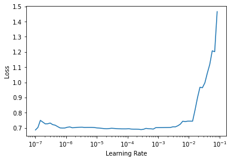
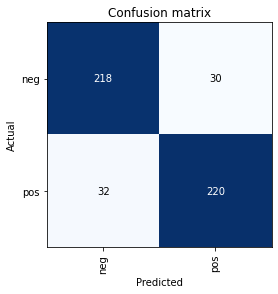

# Fastai Transformers
> train Huggingface transformers using fastai


## Classification Example

```
import transformers
from transformers import AutoTokenizer, AutoModelForSequenceClassification
from fastai_transformer.core import *
from fastai.text.all import *
```

```
# cuda
from fastai.distributed import *
```

```
pretrained_weights = 'bert-base-uncased'
tokenizer = AutoTokenizer.from_pretrained(pretrained_weights)
model = AutoModelForSequenceClassification
```

```
df = pd.read_csv('test_data.csv')
```

```
dls = TextDataLoaders.from_df_with_custom_tok(df, custom_tok = tokenizer, bs = 32, seq_len = 256)
```

```
dls.show_batch(max_n = 2)
```


<table border="1" class="dataframe">
  <thead>
    <tr style="text-align: right;">
      <th></th>
      <th>text</th>
      <th>category</th>
    </tr>
  </thead>
  <tbody>
    <tr>
      <th>0</th>
      <td>what exactly was going on during world war 11 in new zealand when american forces were there? &lt; br / &gt; &lt; br / &gt; this awful story of 4 sisters was really pathetic to view. can you imagine casting joan fontaine as the older sister to sandra dee? fontaine looked more like her mother. even funnier was that fontaine becomes pregnant in the film. &lt; br / &gt; &lt; br / &gt; piper laurie and paul newman who showed such great on screen chemistry 4 years later in " the hustler, " have no scenes together in this film. laurie plays another sister who goes off to wellington to tramp around there, despite the fact that she is married. woe to her when her husband comes back from the war. &lt; br / &gt; &lt; br / &gt; jean simmons is widowed and finds romance with a much subdued</td>
      <td>neg</td>
    </tr>
    <tr>
      <th>1</th>
      <td>i managed to grab a viewing of this with the aid of mst3k, and oh boy, even with the riffing this movie was excruciatingly bad. imagine someone whose competence with a camera could be out done by a monkey. &lt; br / &gt; &lt; br / &gt; the highlights ( what little there were ) came from the special effects, which were " ok ". the acting for the most part was also " ok " ; though nothing special, it was of a higher quality than other b - movies i have seen in the past. &lt; br / &gt; &lt; br / &gt; the rest of this movie is dismally bad, the camera work often looks like they've just put the camera man on roller skates and pushed him along. the story ( if it can be called that ) is so full of holes it's almost funny,</td>
      <td>neg</td>
    </tr>
  </tbody>
</table>


```
# cuda
learn = transformers_classifier_learner(dls, model, 
                                        model_name=pretrained_weights, 
                                        metrics = accuracy).to_fp16()
learn.unfreeze()
learn = learn.to_parallel()
```

    Some weights of the model checkpoint at bert-base-uncased were not used when initializing BertForSequenceClassification: ['cls.predictions.bias', 'cls.predictions.transform.dense.weight', 'cls.predictions.transform.dense.bias', 'cls.predictions.decoder.weight', 'cls.seq_relationship.weight', 'cls.seq_relationship.bias', 'cls.predictions.transform.LayerNorm.weight', 'cls.predictions.transform.LayerNorm.bias']
    - This IS expected if you are initializing BertForSequenceClassification from the checkpoint of a model trained on another task or with another architecture (e.g. initializing a BertForSequenceClassification model from a BertForPreTraining model).
    - This IS NOT expected if you are initializing BertForSequenceClassification from the checkpoint of a model that you expect to be exactly identical (initializing a BertForSequenceClassification model from a BertForSequenceClassification model).
    Some weights of BertForSequenceClassification were not initialized from the model checkpoint at bert-base-uncased and are newly initialized: ['classifier.weight', 'classifier.bias']
    You should probably TRAIN this model on a down-stream task to be able to use it for predictions and inference.


```
# cuda
learn.lr_find()
```


    SuggestedLRs(lr_min=2.7542287716642023e-05, lr_steep=0.05754399299621582)





```
# cuda
learn.fit_one_cycle(5, 1e-4, wd = 1e-4)
```


<table border="1" class="dataframe">
  <thead>
    <tr style="text-align: left;">
      <th>epoch</th>
      <th>train_loss</th>
      <th>valid_loss</th>
      <th>accuracy</th>
      <th>time</th>
    </tr>
  </thead>
  <tbody>
    <tr>
      <td>0</td>
      <td>0.615812</td>
      <td>0.510021</td>
      <td>0.782000</td>
      <td>00:12</td>
    </tr>
    <tr>
      <td>1</td>
      <td>0.420756</td>
      <td>0.318907</td>
      <td>0.852000</td>
      <td>00:12</td>
    </tr>
    <tr>
      <td>2</td>
      <td>0.251596</td>
      <td>0.388430</td>
      <td>0.864000</td>
      <td>00:12</td>
    </tr>
    <tr>
      <td>3</td>
      <td>0.120213</td>
      <td>0.415854</td>
      <td>0.866000</td>
      <td>00:12</td>
    </tr>
    <tr>
      <td>4</td>
      <td>0.050342</td>
      <td>0.407168</td>
      <td>0.876000</td>
      <td>00:12</td>
    </tr>
  </tbody>
</table>


```
# cuda
interp = ClassificationInterpretation.from_learner(learn)
```


```
# cuda
interp.plot_confusion_matrix()
```




